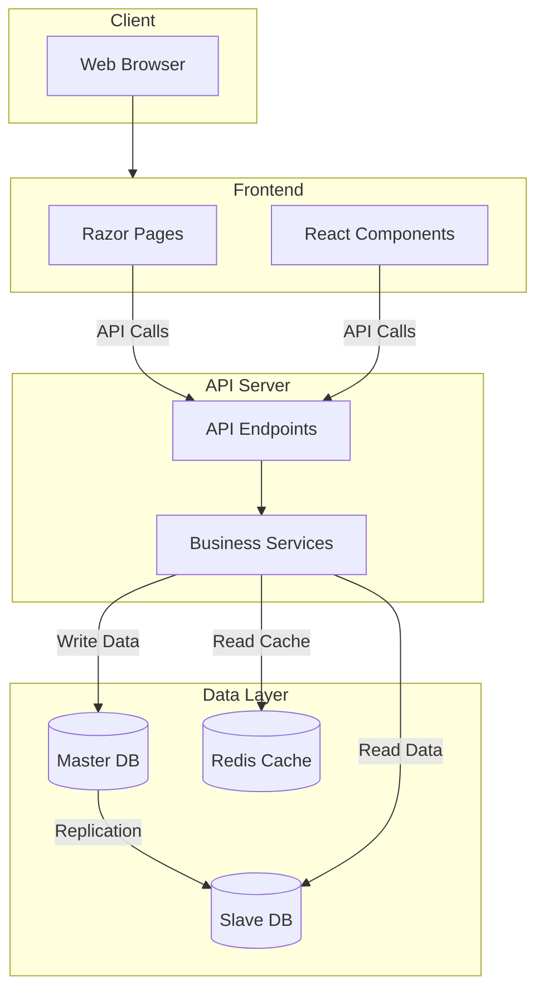

# DiemEcommerce Platform

DiemEcommerce is a robust e-commerce platform built with modern .NET technologies, focusing on connecting manufacturers (factories) with customers in a multi-vendor marketplace environment. The system implements a clean, domain-driven architecture with CQRS patterns and follows industry best practices.

## Architecture Overview



The platform follows a clean, layered architecture:

```
DiemEcommerce/
├── DiemEcommerce.API             # API endpoints and configuration
├── DiemEcommerce.Application     # Application business logic and use cases
├── DiemEcommerce.Contract        # DTOs, interfaces, and contracts between layers
├── DiemEcommerce.Domain          # Core domain models and business rules
├── DiemEcommerce.Infrastructure  # External services and infrastructure concerns
├── DiemEcommerce.Persistence     # Data access and database concerns
└── DiemEcommerce.Presentation    # Presentation layer with API endpoints
```

## Key Features

- **Multi-Vendor Marketplace**: Manufacturers can register and list their products
- **User Authentication**: JWT-based authentication with refresh token support
- **Product Management**: CRUD operations for factories to manage their products
- **Order Processing**: Complete order workflow (place, pay, process, ship, deliver)
- **Payment System**: Support for wallet-based transactions
- **Feedback System**: Customer feedback and ratings for products
- **Master-Slave Database**: Read-write split for improved performance
- **Caching**: Redis-based caching for improved performance
- **Media Storage**: Cloudinary integration for media uploads

## Technologies

- **Backend**: .NET 8, ASP.NET Core
- **Database**: PostgreSQL with master-slave replication
- **Caching**: Redis
- **Messaging**: MediatR for CQRS implementation
- **Validation**: FluentValidation
- **API Documentation**: Swagger/OpenAPI
- **Authentication**: JWT Tokens
- **Media Storage**: Cloudinary
- **Containerization**: Docker

## Database Schema

The system uses PostgreSQL and includes entities such as:
- Users & Roles
- Factories
- Categories
- Products (Matches)
- Orders & Order Details
- Feedback
- Transactions

## Getting Started

### Prerequisites

- .NET 8 SDK
- Docker and Docker Compose
- PostgreSQL
- Redis

### Setup and Installation

1. Clone the repository
```bash
git clone https://github.com/yourusername/DiemEcommerce.git
cd DiemEcommerce
```

2. Create `.env` file with the following variables:
```
DB_PASSWORD=your_password
JWT_SECRET=your_jwt_secret
JWT_ISSUER=your_issuer
JWT_AUDIENCE=your_audience
MAIL=your_email
MAIL_PASSWORD=your_email_password
MAIL_HOST=smtp.example.com
MAIL_PORT=587
MAIL_DISPLAY_NAME=DiemEcommerce
CLOUDINARY_CLOUD_NAME=your_cloud_name
CLOUDINARY_API_KEY=your_api_key
CLOUDINARY_API_SECRET=your_api_secret
```

3. Run PostgreSQL and Redis using Docker Compose
```bash
docker-compose up -d
```

4. Set up database replication
```bash
./setup-replication.sh
```

5. Run database migrations
```bash
dotnet ef database update --project DiemEcommerce.Persistence --startup-project DiemEcommerce.API
```

6. Run the application
```bash
dotnet run --project DiemEcommerce.API
```

The API will be available at http://localhost:8080 with Swagger documentation at http://localhost:8080/swagger.

## API Endpoints

The API is versioned and includes the following major endpoint groups:

- `/api/v1/auth` - Authentication endpoints
- `/api/v1/factories` - Factory management
- `/api/v1/matches` - Product management
- `/api/v1/orders` - Order management
- `/api/v1/feedback` - Feedback management
- `/api/v1/category` - Category management

## Architecture Details

### CQRS Implementation

The application uses the Command Query Responsibility Segregation pattern:
- Commands: For operations that change state
- Queries: For operations that read state

This is implemented using MediatR and a collection of handlers.

### Database Replication

The system implements master-slave database replication:
- Master database handles write operations
- Slave database handles read operations

This improves performance by distributing database load.

### Caching Strategy

The application uses Redis for caching with several patterns:
- Command/query response caching
- Distributed cache for session data
- Cache invalidation on relevant updates

### Pipeline Behaviors

The application implements several pipeline behaviors using MediatR:
- Validation
- Performance monitoring
- Caching
- Transactions
- Tracing

## Development Guidelines

### Adding a New Feature

1. Define contracts in `DiemEcommerce.Contract`
2. Implement domain models in `DiemEcommerce.Domain`
3. Create application handlers in `DiemEcommerce.Application`
4. Add API endpoints in `DiemEcommerce.Presentation`
5. Register endpoints in API project

### Running Tests

```bash
dotnet test
```

## Deployment

The application can be deployed using Docker:

```bash
docker-compose -f docker-compose.yml -f docker-compose.prod.yml up -d
```

## Contributing

1. Fork the repository
2. Create a feature branch
3. Commit your changes
4. Push to the branch
5. Create a new Pull Request

## License

This project is licensed under the MIT License - see the LICENSE file for details.

## Acknowledgments

- Clean Architecture principles
- Domain-Driven Design concepts
- CQRS pattern implementation